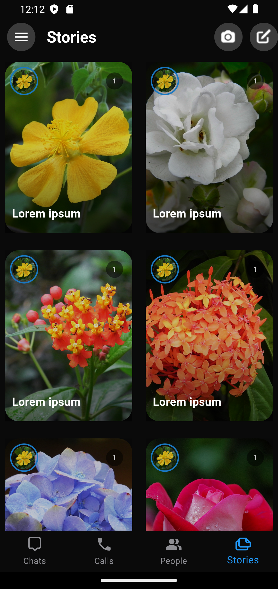

# facebook-messenger-clone_flutter

<h3>Description:</h3>

This repository contains a clone of the Facebook Messenger user interface (UI) built using the Flutter framework. The project aims to recreate the visual appearance and user experience of the Facebook Messenger app without implementing backend actions or functionality.

<h3>ScreenShots:</h3>

  
  

